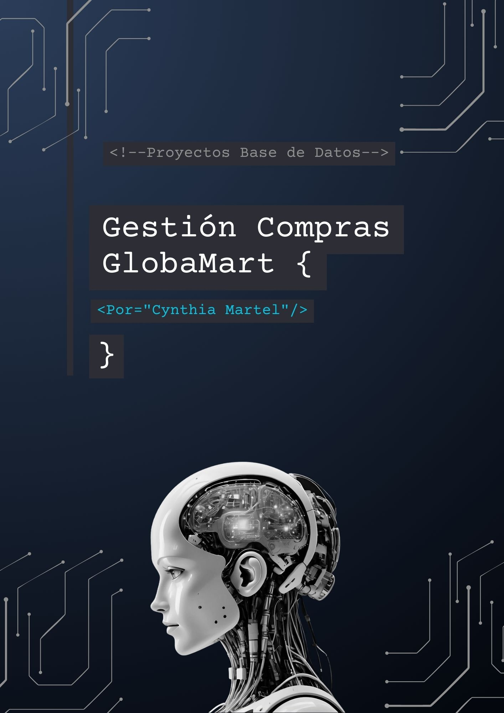

# Portada

## Índice
### 1. Introducción
### 2. Análisis Enunciado
### 3. Modelo Relacional
### 4. Modelo Conceptual
### 5. Implementación MySQL
### 6. Consultas
### 7. Ampliación base datos
### 8. Vistas y Triggers
### 9. Pruebas y Validación
### 10. Conclusiones
### 11. Anexos

# 1. Introducción
En el presente informe abordamos el desarrollo de un sistema de gestión de compras para la empresa **GlobalMart Ltda**., realizado para el módulo de Base de Datos del primer curso del Ciclo Formativo de Desarrollo de Aplicaciones Multiplataformas. 

La realización de este proyecto, tiene como objetivo la aplicación de diferentes herramientas, conceptos y otros conocimientos que hemos ido adquiriendo a lo largo de las clases impartidas del módulo anteriormente mencionado. 

Durante el desarrollo del proyecto, se dispone el análisis inicial de las necesidades de la empresa GlobalMart Ldt., la identificación de entidades y atributos para el diseño de su modelo conceptual. 
Así mismo, y partiendo de este último, se trabajará en la creación del modelo relacional y su implementación en MySql con WorkBench, para después llevar a cabo la inserción de los datos correspondientes. Posteriormente se ejecutará la consulta de pruebas, creación de vistas y triggers para la mejora de la automatización y el acceso a las consultas informativas. 
Se propone, además, una serie de nuevas funcionalidades para la mejora de la gestión de compras de la empresa.

Por otra parte, se adjuntará una serie de scripts y otros recursos complementarios, a modo de enriquecer la información aportada.

Como resultado del trabajo realizado, se ejecutará un modelo de datos eficaz y bien estructurado que permita gestionar la información relacionada con proveedores, productos y pedidos, optimizando así los procesos internos de la empresa GlobalMart Ldta.

# 2. Análisis
Según el enunciado inicial presente en el archivo llamado “GlobalMart Ltda.md”, en donde se expone las necesidades y objetivos de la empresa con respecto al manejo de su base de datos, realizamos el siguiente análisis a modo de resumen.

## **Contexto y Desafíos** 🛠️:
 GlobalMart Ltda. enfrenta varios problemas operativos en su gestión de compras:
Falta de integración eficaz entre proveedores, productos y pedidos.
Dificultades para rastrear el historial de compras y el estado de los pedidos.
Gestión manual que puede genera errores y retrasos.

##🎯 **Necesidades del Sistema**:
Mejorar la integración: Conectar proveedores, productos y pedidos para evitar inconsistencias.
Control de inventarios: Facilitar el seguimiento del historial de compras y el estado de los pedidos.
Automatizar procesos: Reducir errores humanos, retrasos y acelerar tiempos de respuesta.
Análisis de datos: Proporcionar información organizada y actualizada, sobre rendimiento de proveedores, tendencias de compras y costos asociados.

##📄 Se espera construir un sistema de gestión de compra que permita superar los desafíos actuales, mejorar la eficacia en la operativa de la empresa y la buena trazabilidad de los datos para el crecimiento futuro de la empresa.

###🌱 **Presentación de GlobalMart** ♻️ (Presentación ficticia)

GlobalMart Ltd. es una empresa comprometida con el comercio sostenible y en disminuir el impacto ambiental. Nos dedicamos a la distribución de productos de papelería, electrónica, textiles y accesorios con un enfoque en el respeto ecológico y el apoyo a proveedores locales que comparten nuestros valores éticos.

En GlobalMart Ltd., tenemos la misión de impulsar un cambio en el paradigma de la cotidianidad: un compromiso ecológico real y el desarrollo de la economía local. Esto se refleja en:

🌱 Catálogo 100% ecológico, con productos reciclados y reutilizables.
💡 Red de proveedores locales canarios para minimizar la huella de carbono y promover la economía circular.
👕 Políticas de stock responsable, priorizando la calidad y la durabilidad.
♻️ Gestión eficiente de residuos y embalaje ecológico.

###📝 Estructura del desarrollo
El sistema se desarrolla siguiendo una estructura clara y organizada, que pretende facilitar la documentación del proyecto, así como su implementación. 
Se presenta aquí, la estructura propuesta que se ha seguido:

📄 Archivo informe.md: contiene toda la documentación técnica y funcional del sistema, desde el análisis hasta el modelo físico y conclusiones.

📁 Carpeta Scripts/: incluye los archivos .sql con las sentencias para la creación de tablas, inserción de datos y consultas informativas.

📁 Carpeta Recursos/: almacena información complementaria, referencias o ejemplos adicionales.

📁 Carpeta Capturas/: contiene imágenes del modelo entidad-relación y otras representaciones visuales que acompañan el análisis y diseño del sistema.

# 3. Modelo Conceptual

El modelo conceptual de la empresa GlobalMart Ldt., se orienta a la gestión de compras, contemplando los distintos elementos que intervienen en su relaciones y ejecución. 

Como buena práctica, el modelo conceptual es asienta las bases para la creación de la base de datos. Se realizó orientado al enfoque Entidad-Relación (E-R).

##📊 *Entidades princpales del modelo conceptual*
Se presenta a continuación, un análisis de las entidades clave que compondrá dicho modelo conceptual, cada una con sus respectivos atributos. La clave primaria se representa con “PK” (siglas que provienen de “Princpal Key”, en inglés), y la clave foránea con “FK” (siglas que provienen de “Foreing Key”, también en inglés). Se explicarán estos dos coceptos con más detenimiento en el apartado 3 de este informe.

###1. Proveedor
Información sobre las empresas o personas que suministran productos.

-idProveedor (PK): Identificador único del proveedor.
-nombre: Nombre del proveedor o empresa.
-numeroTelefono: Teléfono de contacto del proveedor.
-direccion: Dirección postal del proveedor.
-email: Correo electrónico del proveedor.

###2. Producto
Datos sobre los productos gestionados por la empresa.

-idProducto (PK): Identificador único del producto.
-nombre: Nombre del producto.
-descripcion: Detalle o información adicional sobre el producto.
-precio: Precio unitario del producto.
-stock: Cantidad disponible en almacén.
-categoria: Clasificación del producto (ej. electrónica, hogar, etc.).
-id_Proveedor (FK): Clave foránea que relaciona el producto con su proveedor.

###3. Pedido
Registro de cada compra realizada a un proveedor.

-idPedido (PK): Identificador único del pedido.
-fechaPedido: Fecha en la que se realizó el pedido.
-fechaEntrega: Fecha estimada o real de entrega del pedido.
-estadoPedido: Estado actual del pedido (pendiente, enviado, entregado, etc.).
-importeTotal: Monto total del pedido (calculado sumando los subtotales de los productos).

###4. DetallePedido
Entidad intermedia para representar los productos incluidos en un pedido (relación muchos a muchos).

-idDetallePedido (PK): Identificador único del detalle del pedido.
-id_Pedido (FK): Clave foránea que relaciona con el pedido correspondiente.
-id_Producto (FK): Clave foránea que relaciona con el producto correspondiente.
-cantidadSolicitada: Cantidad de unidades pedidas de ese producto.
-precioUnitario: Precio del producto en el momento del pedido.
-subtotal: Resultado de multiplicar la cantidad solicitada por el precio unitario.

##🔗 Relaciones entre Entidades
Para el funcionamiento de las tablas, estas necesitan de relaciones entre ellas. Estas son las relaciones princpales que completan el modelo conceptual:
-*(Proveedor – Producto)* 1:N : Un proveedor TIENE muchos productos, pero cada producto tiene un solo proveedor → relación 1:N entre Proveedor y Producto. 

-*(Producto- Pedido)* N:1 : Un producto CONTIENE varios pedidos, pero cada pedido corresponde a un solo producto  → relación N:1 entre Pedido y Proveedor. 

-*(Producto - Pedido - DetallePedido)* N:M Un pedido TIENE varios productos y cada producto puede estar en varios pedidos → relación N:M, resuelta con la entidad DetallePedido. 

## 🔍 *Modelo Conceptual gráfico con draw io*
A continuación, se representa el corrrespondiente modelo conceptual desarrollado en Draw.io. De esta manera, se puede visualizar de manera gráfica, las entidades clave del sistema de gestión de compra de la empresa GlobalMart Ldt., donde se dibujan las entidades principales, sus atributos y las relaciones entre ellas.

